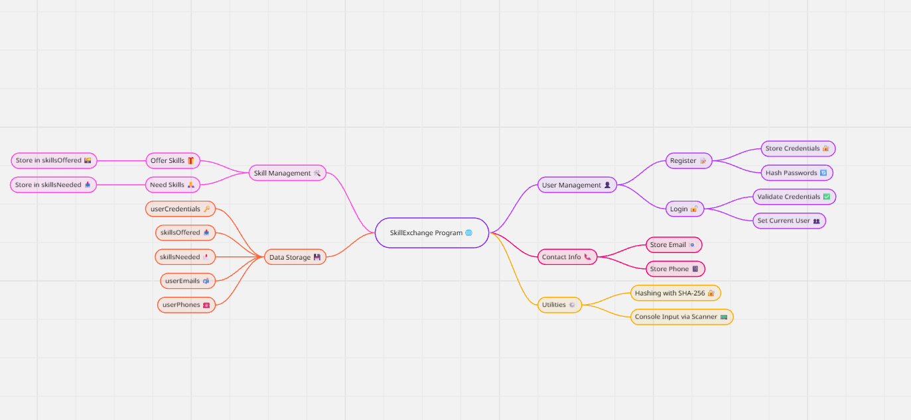
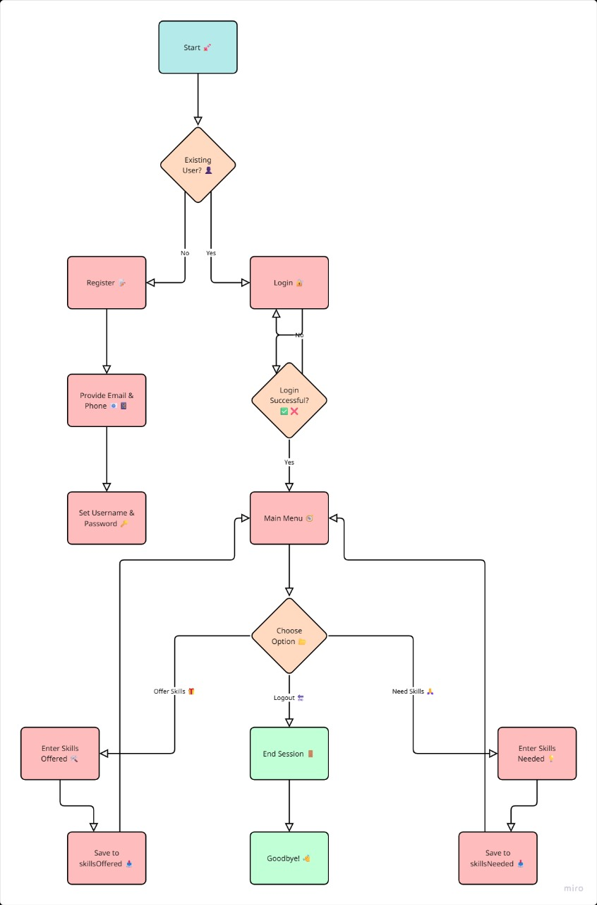

# 🎓 Peer Skill Exchange System

[](https://java.com)
[](LICENSE)
[](https://github.com/zaheer037/SkillExchange)

## 📋 Table of Contents
- [Overview](#-overview)
- [Key Features](#-key-features)
- [Architecture & Design](#️-architecture--design)
<!-- - [Screenshots & Demo](#-screenshots--demo) -->
- [Installation & Setup](#-installation--setup)
- [Usage Guide](#-usage-guide)
- [Technical Specifications](#-technical-specifications)
- [Security Features](#️-security-features)
- [Future Enhancements](#-future-enhancements)
- [Contributing](#-contributing)
- [License](#-license)

## 🌟 Overview

The **Peer Skill Exchange System** is a comprehensive Java-based console application that facilitates peer-to-peer learning by connecting individuals who want to share and learn skills. This platform creates a collaborative environment where users can teach what they know and learn what they need, fostering a community of continuous learning and knowledge sharing.

### 🎯 Problem Statement
In today's rapidly evolving world, traditional learning methods often fall short of providing personalized, accessible, and cost-effective skill development. Our platform addresses this gap by creating a decentralized learning ecosystem where knowledge flows naturally between peers.

### 💡 Solution
A robust, secure, and user-friendly platform that matches learners with teachers based on complementary skill sets, enabling direct knowledge exchange with integrated communication tools.

## ✨ Key Features

### 🔐 User Management
- **Secure Registration System** with password strength validation
- **SHA-256 Password Hashing** for enhanced security
- **Email & Phone Validation** with specific format requirements
- **User Profile Management** with editable contact information

### 🎯 Skill Management
- **Dual Skill Categorization**: Skills to teach vs. skills to learn
- **Conflict Prevention**: Users cannot offer and request the same skill
- **Dynamic Skill Addition** with real-time validation
- **Comprehensive Skill Viewing** for profile management

### 🔍 Smart Matching System
- **Intelligent Algorithm** that matches learners with relevant teachers
- **Real-time Match Discovery** based on complementary skills
- **Connection Request System** with approval workflow
- **Contact Sharing** upon mutual agreement

### 💬 Communication Platform
- **Built-in Chat System** for connected users
- **Persistent Message Storage** across sessions
- **Real-time Messaging** with chat history
- **Secure Communication Channels** between matched users

### 📧 Notification System
- **Connection Request Notifications**
- **Contact Sharing Alerts**
- **Interactive Response System**
- **Notification Management** with accept/decline options

### 💾 Data Persistence
- **File-based Storage System** for user data
- **Automatic Data Saving** on exit
- **Session Management** with data recovery
- **Structured Data Organization** across multiple files

## 🏗️ Architecture & Design

### System Architecture Diagram




### Class Structure
- **Main Class**: `SkillExchange.java`
- **Core Components**:
  - User Authentication & Authorization
  - Skill Management Engine
  - Matching Algorithm
  - Communication System
  - Data Persistence Layer

## 📸 Screenshots & Demo

<!--
### 🖼️ Screenshot Suggestions

> **For Project Evaluators**: Here are the key screens you should capture to showcase the application:

#### 1. **Welcome Screen & Main Menu**
- **Location**: Application startup
- **What to capture**: The welcome message and main menu options (Register/Login/Exit)
- **Why important**: Shows professional UI design and initial user experience

#### 2. **Registration Process**
- **Location**: During user registration
- **What to capture**: 
  - Password validation in action
  - Email format validation (@gmail.com requirement)
  - Phone number validation (10-digit requirement)
  - Success confirmation message
- **Why important**: Demonstrates robust input validation and user feedback

#### 3. **User Dashboard**
- **Location**: After successful login
- **What to capture**: The comprehensive dashboard menu with all 8 options
- **Why important**: Shows the full range of application features

#### 4. **Skill Management Interface**
- **Location**: Options 1, 2, and 3 in dashboard
- **What to capture**: 
  - Adding skills to teach
  - Adding skills to learn
  - Viewing personal skill profile
  - Conflict prevention when adding duplicate skills
- **Why important**: Core functionality demonstration

#### 5. **Smart Matching System**
- **Location**: Option 4 in dashboard
- **What to capture**: 
  - Search results showing matched users
  - Connection request interface
  - "No matches found" scenario
- **Why important**: Shows the intelligent matching algorithm

#### 6. **Profile Management**
- **Location**: Option 5 in dashboard
- **What to capture**: 
  - Complete profile view with all details
  - Profile editing interface
  - Contact information update process
- **Why important**: Demonstrates data management capabilities

#### 7. **Notification System**
- **Location**: Option 6 in dashboard
- **What to capture**: 
  - Incoming connection requests
  - Notification response interface
  - Contact sharing approval process
- **Why important**: Shows interactive communication features

#### 8. **Chat System**
- **Location**: Option 7 in dashboard
- **What to capture**: 
  - Chat connection list
  - Active chat conversation
  - Message history display
- **Why important**: Demonstrates real-time communication capabilities

#### 9. **Data Persistence**
- **Location**: File explorer showing generated files
- **What to capture**: The various .txt files created by the application
- **Why important**: Shows data storage and persistence capabilities

#### 10. **Security Features**
- **Location**: Login attempts and password validation
- **What to capture**: 
  - Failed login attempts
  - Password strength requirements
  - Successful authentication
- **Why important**: Demonstrates security implementation

### 🎥 Demo Flow Suggestions
1. **Complete User Journey**: Register → Login → Add Skills → Find Matches → Connect → Chat
2. **Multi-User Scenario**: Show two users connecting and exchanging contact information
3. **Error Handling**: Demonstrate validation errors and recovery
-->

## 🚀 Installation & Setup

### Prerequisites
- Java Development Kit (JDK) 8 or higher
- Command Line Interface (Terminal/Command Prompt)
- Text Editor or IDE (optional, for code viewing)

### Quick Start

1. **Clone the Repository**
   ```bash
   git clone https://github.com/zaheer037/SkillExchange.git
   cd PeerSkillExchange
   ```

2. **Compile the Application**
   ```bash
   javac src/SkillExchange.java
   ```

3. **Run the Application**
   ```bash
   java -cp src SkillExchange
   ```

### Alternative Setup
If you prefer working with an IDE:
1. Import the project into your preferred Java IDE
2. Set the main class as `SkillExchange`
3. Run the application

## 📖 Usage Guide

### User Workflow Diagram



### First Time User
1. **Registration**
   - Choose option 1 from the main menu
   - Create a unique username
   - Set a strong password (min 8 chars, 1 uppercase, 1 special character)
   - Provide a valid Gmail address
   - Enter a 10-digit phone number

2. **Profile Setup**
   - Add skills you can teach
   - Add skills you want to learn
   - Review your profile

### Finding Connections
1. **Skill Matching**
   - Use "Find skill matches" option
   - Review suggested connections
   - Send connection requests

2. **Managing Requests**
   - Check notifications regularly
   - Approve or decline connection requests
   - Share contact information upon approval

### Communication
1. **Starting Conversations**
   - Access the chat system
   - Select from your connections
   - Send and receive messages

## 🔧 Technical Specifications

### Core Technologies
- **Language**: Java 8+
- **Security**: SHA-256 Hashing Algorithm
- **Storage**: File-based Persistence
- **Architecture**: Object-Oriented Design

### Data Storage Structure
```
📁 Project Root
├── 📄 users.txt (usernames and hashed passwords)
├── 📄 skills_offered.txt (skills users can teach)
├── 📄 skills_needed.txt (skills users want to learn)
├── 📄 emails.txt (user email addresses)
├── 📄 phones.txt (user phone numbers)
├── 📄 notifications.txt (system notifications)
└── 📄 chats.txt (chat messages and history)
```

### Performance Metrics
- **Startup Time**: < 2 seconds
- **Data Loading**: Instant for typical datasets
- **Memory Usage**: Minimal footprint
- **Concurrent Users**: File-based system supports sequential access

### Validation Rules
- **Passwords**: Minimum 8 characters, 1 uppercase, 1 special character
- **Email**: Must end with `@gmail.com`
- **Phone**: Exactly 10 digits
- **Usernames**: Must be unique across the system

## 🛡️ Security Features

### Authentication & Authorization
- **Secure Password Storage**: SHA-256 cryptographic hashing
- **Input Validation**: Comprehensive input sanitization
- **Session Management**: Secure user session handling
- **Access Control**: Feature access based on login status

### Data Protection
- **Local Storage**: No cloud dependencies, enhanced privacy
- **Data Integrity**: Validation at every input point
- **Error Handling**: Graceful error management without data exposure

### Privacy Measures
- **Contact Sharing**: Only after mutual consent
- **User Control**: Users control their information sharing
- **No Data Mining**: No analytics or tracking

## 🚀 Future Enhancements

### Short-term Goals
- [ ] **GUI Implementation** - JavaFX or Swing interface
- [ ] **Database Integration** - MySQL/PostgreSQL support
- [ ] **Skill Categories** - Organized skill taxonomy
- [ ] **Rating System** - User feedback and ratings

### Medium-term Goals
- [ ] **Web Application** - Browser-based interface
- [ ] **Mobile Application** - Android/iOS apps
- [ ] **Real-time Chat** - WebSocket implementation
- [ ] **File Sharing** - Document and resource sharing

### Long-term Vision
- [ ] **AI-Powered Matching** - Machine learning algorithms
- [ ] **Video Conferencing** - Integrated video calls
- [ ] **Payment Integration** - Monetization options
- [ ] **Community Features** - Groups and forums

## 🤝 Contributing

### How to Contribute
1. **Fork the Repository**
2. **Create a Feature Branch**
   ```bash
   git checkout -b feature/amazing-feature
   ```
3. **Commit Your Changes**
   ```bash
   git commit -m 'Add amazing feature'
   ```
4. **Push to the Branch**
   ```bash
   git push origin feature/amazing-feature
   ```
5. **Open a Pull Request**

### Contribution Guidelines
- Follow Java coding conventions
- Add comments for complex logic
- Test thoroughly before submitting
- Update documentation as needed

### Areas for Contribution
- UI/UX improvements
- Additional validation features
- Performance optimizations
- Security enhancements
- Documentation improvements

## 👨‍💻 Developer Information

**Developer**: Zaheer  
**GitHub**: [@zaheer037](https://github.com/zaheer037)  
**Project**: Peer Skill Exchange System  
**Version**: 1.0.0  
**Last Updated**: July 2025

## 📄 License

This project is licensed under the MIT License - see the [LICENSE](LICENSE) file for details.

### MIT License Summary
- ✅ Commercial use
- ✅ Modification
- ✅ Distribution
- ✅ Private use
- ❌ Liability
- ❌ Warranty

## 🙏 Acknowledgments

- **Java Community** for comprehensive documentation
- **Open Source Contributors** for inspiration
- **Peer Learning Enthusiasts** for concept validation
- **Security Best Practices** from OWASP guidelines

---

<div align="center">

### 🌟 Star this repository if you found it helpful!

**Made with ❤️ for the learning community**

[⬆ Back to Top](#-peer-skill-exchange-system)

</div>
